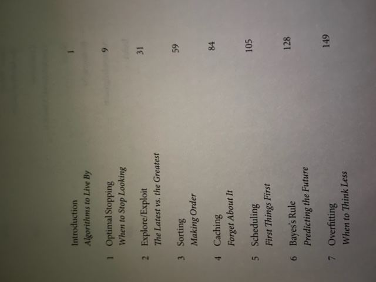
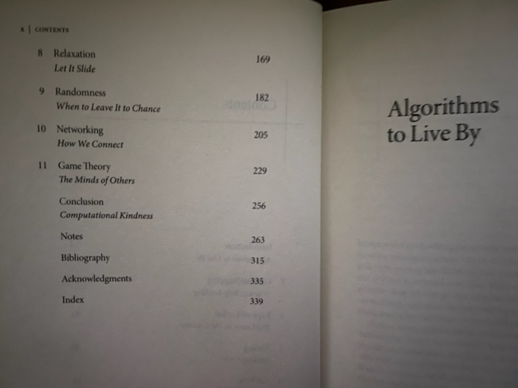

# algorithms-to-live-by
This repository has code related to concepts explored in the book "Algorithms to Live By: The Computer Science of Human Decisions" by Brian Christian and Tom Griffiths. 

The goal of this repository is to write at least one piece of code related to each chapter, with each piece of code exploring a different language or technology.

Some of the code has notes on how the language's syntax and structure compares with Python (or JavaScript).

Chapter 1 "Optimal Stopping" (Python): 

python lookThenLeap.py 

This code relates to a situation where you are only interested in finding *the best* ranked object in a set of n objects.
you see the objects one at a time. you learn the current observation's ordinal relationship to all the objects that have come before it.
if you look for too long, you may pass over the best of the lot. if you leap too soon, you may not have "explored" enough. 
(Note: This is not a Bayesian updating "exploration" but rather the optimal balance in a Platonic math object.)

Chapter 2 "Explore/Exploit" (JavaScript)

node exploreExploit.js 

This code relates to the multi-arm bandit problem where each slot machine has a binary payoff (not a Real/float Gaussian Random Variable payout).
You can look at how variations of "win-stay, lose-switch" policy/strategy performs on slot machines with various win/lose probabilities.
You can modify parts of the program to handle, say, the switching protocol differently. (i.e. epsilon-greedy, decreasing epsilon/exploration over time, etc.) You could also do something akin to grid search of hyper-parameters to exhaustively map out some space of results (using a for loop over scenarios or a .map()).

Chapter 3 "Sorting" (C++):

"g++ sorting.cpp -o sorting_compiled" or "clang++ -std=c++11 sorting.cpp -o sorting_compiled" to compile it 
"./sorting_compiled" to run the executable

This code implements MergeSort, a popular sorting algorithm. In MergeSort, you first break your list down into n separate lists. They are sorted singleton lists to start. You then merge those sorted lists two at a time (which you can do in one pass of the lists (linear time)) to get n/2 sorted lists for the next recursive call or iteration. The overall time complexity is O(n*log(n))

Chapter 4 "Caching" (Redis):

"brew services start redis" to start your Redis server.
"python Redis_caching.py" to run the code that utilizes Redis caching.

This code explores Redis (REmote DIctionary Server) for caching (and storing/persisting). Redis is a NoSQL db that allows us to save data in key-value form in-memory (so it has fast retrieval and writes) outside our main web service. This makes the main web application stateless (so there's no problem restarting your server as you won't lose data) and easy to scale since the Redis db can be replicated and be made highly available (see Redis Sentinel). Redis is very useful when you are dealing with many client sessions where the data they are querying/computing takes a little while to retrieve and the requested data will likely be re-requested by that user or another user again soon. All queries from the different client sessions can reference the same Redis database, sharing a common cache. To see details of a Least Recently Used cache with underlying Doubly-linked list and dictionary (hash table) data structure that enables constant time eviction, check this code out:

https://github.com/Digital-Physics/algorithms/blob/main/lru_cache.py

Chapter 5 "Scheduling" (Common Lisp):

"sbcl --script scheduling.lsp"

This code schedules laundry loads (where each load has an associated wash time and dry time) to maximize efficient use of a single washer and dryer machine. The goal is to schedule the loads such that you minimize the total run time, which corresponds to maximizing the amount of time both machines are being being made productive at the same time.

Chapter 6 "Bayes' Rule" (Haskell):

This code simply implements Bayes's rule.

"ghc -o bayes Main.hs" to compile it
"./bayes" to run it

or 

ghci
Prelude> :load Main.hs
*Main> bayes 0.01 0.9 0.05

Chapter 7 "Overfitting":

Chapter 8 "Relaxation":

Chapter 9 "Randomness":

Chapter 10 "Networking":

Chapter 11 "Game Theory":

Possible future languages:

Rust (let's get some memory safety going)
Haskell 
Scala
C
C#
Zig
typeScript

